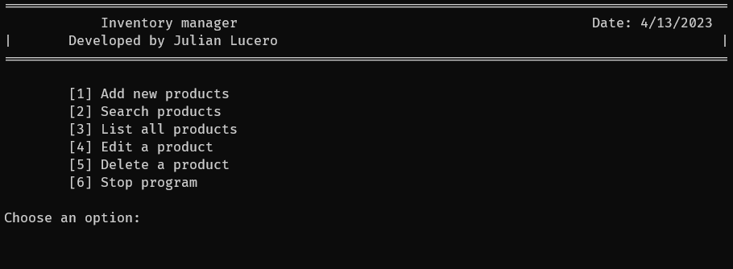

# Console inventory manager

*This is a very special project since it was one of the first ones I did when I started learning programming*




> To run this project you need python 3

1. Clone the repository
2. Open your preferred terminal and go to the project folder.
3. Run ```python main.py```

# Features

* Add new product.
* Edit an existing product.
* Delete an existing product.
* Search for a specific product.
* List all existing products.